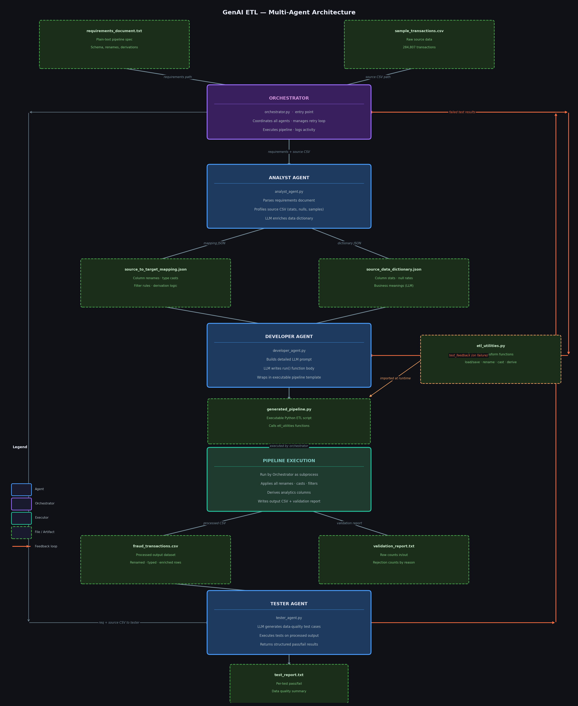

# GenAI ETL Demo — Architecture Overview

## What This System Does

This project demonstrates a **multi-agent AI system** that automatically generates, executes, and validates an ETL (Extract, Transform, Load) pipeline — all driven by a plain-text requirements document and a sample CSV file. No hand-written transformation code required.

**Input:** A business requirements document + raw CSV data  
**Output:** A fully executable Python ETL pipeline, processed dataset, validation report, and test results

---

## Agent Architecture



---

## Step-by-Step Flow

### Step 1 — Orchestrator Starts
The **Orchestrator** reads CLI arguments (requirements path, source CSV, framework) and kicks off the workflow. It is the only agent users interact with directly.

### Step 2 — Analyst Agent: Understand the Data
The **Analyst Agent** receives the requirements document and source CSV. It does two things in parallel:
- **Parse requirements** (deterministic + LLM): extracts the target schema, column rename rules, type casts, derivation formulas, and filter conditions
- **Profile source data** (pandas): computes row counts, null rates, data types, and sample values; LLM adds business meaning to each column

**Output:** Two structured JSONs that fully describe the transformation contract.

### Step 3 — Developer Agent: Generate the Pipeline
The **Developer Agent** takes the mapping and dictionary JSONs and constructs a detailed prompt for the LLM. The LLM writes a `run()` function that:
- Loads the source CSV
- Applies all renames, type casts, filters, and derivations
- Uses functions from `etl_utilities.py` (the reusable transformation library)
- Writes the processed CSV and a validation report

The agent wraps the generated function in a complete, runnable Python script.

### Step 4 — Pipeline Execution
The Orchestrator executes the generated pipeline as a subprocess. The pipeline writes:
- `data/processed/fraud_transactions.csv` — the transformed dataset
- `data/processed/validation_report.txt` — row counts and rejection breakdown

### Step 5 — Tester Agent: Validate the Output
The **Tester Agent** asks an LLM to write test cases based on the requirements, then runs those tests by comparing the source and processed DataFrames. Tests cover:
- All expected target columns are present
- Column renames were applied correctly
- Timestamps converted from seconds to datetime
- Country codes standardized (`USA` → `US`)
- Derived columns computed correctly (amount category, utilization rate, etc.)
- Row count is reasonable relative to source

**Output:** A test report file and a structured results dictionary.

### Step 6 — Feedback Loop (if tests fail)
If any tests fail, the Orchestrator packages the **failed test details + the previously generated code + the original requirements** into a `test_feedback` object and sends it back to the Developer Agent. The Developer regenerates the pipeline with this context. This loop continues up to `max_retries` times.

---

## Information Passed Between Agents

| From | To | Data Passed |
|------|----|-------------|
| User / CLI | Orchestrator | `requirements_path`, `source_csv_path`, `framework`, flags |
| Orchestrator | Analyst Agent | `requirements_path`, `source_csv_path` |
| Analyst Agent | Developer Agent | `source_to_target_mapping.json`, `source_data_dictionary.json` |
| Developer Agent | Orchestrator | Path to `generated_pipeline.py` |
| Orchestrator | Pipeline | Executes the file (INPUT_PATH, OUTPUT_PATH baked in) |
| Pipeline | Tester Agent | `processed_data_path`, `validation_report_path` |
| Orchestrator | Tester Agent | `requirements_path`, `source_data_path`, `processed_data_path` |
| Tester Agent | Orchestrator | `{ all_passed, test_results[], source_row_count, row_count }` |
| Orchestrator | Developer Agent | `test_feedback: { test_results, generated_code, requirements }` (on failure) |

---

## Key Files

| File | Purpose |
|------|---------|
| [agents/orchestrator.py](agents/orchestrator.py) | Master controller and entry point |
| [agents/analyst_agent.py](agents/analyst_agent.py) | Requirements parsing + data profiling |
| [agents/developer_agent.py](agents/developer_agent.py) | LLM-based pipeline code generation |
| [agents/tester_agent.py](agents/tester_agent.py) | LLM-based test generation + execution |
| [agents/etl_utilities.py](agents/etl_utilities.py) | Reusable transformation function library |
| [agents/activity_logger.py](agents/activity_logger.py) | Structured JSON audit trail |
| [data/raw/requirements_document.txt](data/raw/requirements_document.txt) | Single source of truth for pipeline spec |
| [outputs/generated_pipeline.py](outputs/generated_pipeline.py) | AI-generated ETL script (output artifact) |
| [outputs/generated_tests.py](outputs/generated_tests.py) | AI-generated test function (output artifact) |
| [outputs/source_to_target_mapping.json](outputs/source_to_target_mapping.json) | Column mapping and transformation spec |
| [outputs/source_data_dictionary.json](outputs/source_data_dictionary.json) | Profiled column statistics + business context |
| [data/processed/fraud_transactions.csv](data/processed/fraud_transactions.csv) | Final processed dataset |
| [data/processed/test_report.txt](data/processed/test_report.txt) | Human-readable test results |

---

## How to Run

```bash
# Basic run (analyst + developer + execute)
python -m agents.orchestrator

# With test-driven iteration (recommended for demo)
python -m agents.orchestrator --iterate --max-retries 3

# Skip analyst step (reuse existing mapping)
python -m agents.orchestrator --skip-analyst

# Generate code only, don't execute
python -m agents.orchestrator --skip-run
```

---

## Design Principles

- **Requirements-driven**: The plain-text requirements document is the only human-authored specification. Everything else is generated.
- **LLM for reasoning, utilities for execution**: LLMs write code that calls deterministic helper functions — this keeps generated pipelines predictable and debuggable.
- **Test-driven regeneration**: Failed tests automatically feed back into the generation loop. The system self-corrects without human intervention.
- **Auditable**: Every agent action is logged to `outputs/agent_activity_log.json` with timestamps, inputs, outputs, and status.
- **Modular**: Each agent is independently callable and testable. Swap out any stage without touching the others.
