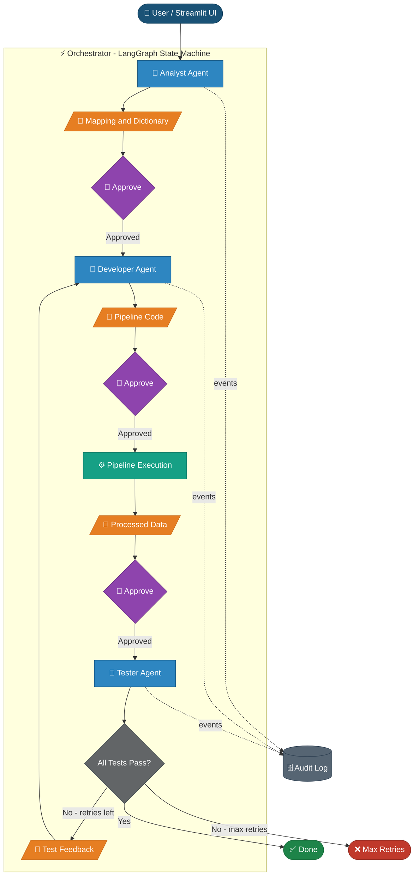

# GenAI ETL Demo

A multi-agent AI system that automatically generates, executes, and validates an ETL pipeline from a plain-text requirements document and a sample CSV file — no hand-written transformation code required.

**Input:** Business requirements document + raw transaction CSV  
**Output:** Executable Python ETL pipeline, processed dataset, validation report, and test results

---

## Agentic Workflow



| | Icon | Shape | Meaning |
|-|------|-------|---------|
|  | 🤖 | Rectangle | AI Agent — makes LLM calls |
|  | 📄 | Parallelogram | File artifact |
|  | 👤 | Diamond | Human approval gate |
|  | ⚙ | Rectangle | Subprocess — no LLM |
|  | 🗄 | Cylinder | Storage |
| | ⚡ | Subgraph border | Coded workflow logic — no LLM |

### Agent Roles

| Agent | File | Responsibility |
|-------|------|---------------|
| Orchestrator | `agents/orchestrator.py` | LangGraph state machine; coordinates agents, runs pipeline subprocess, drives feedback loop |
| Analyst | `agents/analyst_agent.py` | Parses requirements (LLM + rule-based); profiles source data; outputs mapping and data dictionary JSONs |
| Developer | `agents/developer_agent.py` | Generates executable ETL code from mappings; accepts test feedback for iterative regeneration |
| Tester | `agents/tester_agent.py` | LLM-generates test cases from requirements; executes them against processed data; produces structured results |

### Information Flow Between Agents

| From | To | Data |
|------|----|------|
| User / CLI | Orchestrator | `requirements_path`, `source_csv_path`, framework flags |
| Analyst Agent | Developer Agent | `source_to_target_mapping.json`, `source_data_dictionary.json` |
| Developer Agent | Orchestrator | Path to `generated_pipeline.py` |
| Orchestrator | Pipeline | Subprocess execution (INPUT_PATH, OUTPUT_PATH baked in) |
| Pipeline | Tester Agent | `processed_data_path`, `validation_report_path` |
| Tester Agent | Orchestrator | `{ all_passed, test_results[], row_count }` |
| Orchestrator | Developer Agent | `test_feedback: { test_results, generated_code, requirements }` on failure |

---

## Business Context

Organizations need reliable, scalable ingestion pipelines to process raw credit card transaction data for fraud detection models and analytical workloads. This demo shows how AI agents can automate the traditionally manual ETL development lifecycle — reducing development time from weeks to minutes.

---

## Architecture

### Design Principles

- **Requirements-driven**: The plain-text requirements document is the only human-authored specification. Everything else is generated.
- **LLM for reasoning, utilities for execution**: LLMs write code that calls deterministic helper functions in `etl_utilities.py`, keeping generated pipelines predictable and debuggable.
- **Test-driven regeneration**: Failed tests automatically feed back into the generation loop. The system self-corrects without human intervention.
- **Auditable**: Every agent action is logged to `outputs/agent_activity_log.json` with timestamps, inputs, outputs, and status.
- **Modular**: Each agent is independently callable. Swap or extend any stage without touching the others.

### Core Components

#### Analyst Agent (`agents/analyst_agent.py`)
- Parses the requirements document using both LLM and rule-based strategies
- Profiles source CSV columns: row counts, null rates, data types, sample values, outlier flags
- LLM annotates each column with business meaning
- **Outputs**: `outputs/source_to_target_mapping.json`, `outputs/source_data_dictionary.json`

#### Developer Agent (`agents/developer_agent.py`)
- Builds a structured LLM prompt from the mapping and dictionary JSONs
- LLM writes a `run()` function that loads, transforms, and saves the data using `etl_utilities.py`
- Wraps the function in a complete, runnable Python script
- Supports feedback-aware iterative regeneration when tests fail
- **Output**: `outputs/generated_pipeline.py`

#### Tester Agent (`agents/tester_agent.py`)
- LLM generates test cases directly from the requirements document
- Tests validate: required columns present, renames applied, timestamps converted, derived columns computed, row count reasonable
- **Outputs**: `outputs/generated_tests.py`, `data/processed/test_report.txt`

#### Orchestrator (`agents/orchestrator.py`)
- LangGraph state machine with optional human approval checkpoints between phases
- Executes the generated pipeline as a subprocess
- Packages test failures as structured feedback and re-invokes the Developer Agent
- Configurable via CLI flags; supports both automated and interactive modes

### Supporting Components

#### ETL Utilities (`agents/etl_utilities.py`)
Reusable, deterministic transformation functions called by the generated pipeline:
- **I/O**: `load_csv()`, `save_csv()`
- **Column ops**: `rename_columns()`, `cast_column()`, `impute_nulls()`, `replace_blank_with()`
- **Filters**: `filter_non_negative()`, `filter_range()`, `filter_valid_values()`, `filter_not_null()`
- **Derived columns**: `add_ingestion_timestamp()`, `add_transaction_date()`, `add_transaction_hour()`, `add_is_weekend()`, `add_amount_category()`, `add_utilization_rate()`, `add_is_high_risk_context()`
- **Standardization**: `standardize_country_codes()`, `convert_seconds_to_timestamp()`

#### Activity Logger (`agents/activity_logger.py`)
Writes structured JSON events to `outputs/agent_activity_log.json` — timestamps, agent names, stage, status, artifact paths, and iteration summaries.

#### LLM Client (`agents/llm_client.py`)
Thin wrapper around `langchain_openai.ChatOpenAI`. Configured via environment variables; temperature 0 for deterministic generation.

---

## Usage

### Prerequisites

- Python 3.8+
- `pip install -r requirements.txt`
- OpenAI API key (or compatible endpoint)

### Environment Setup

```bash
# .env file (recommended)
OPENAI_API_KEY=your_api_key_here
OPENAI_BASE_URL=https://api.openai.com/v1   # optional — override for custom endpoints
OPENAI_MODEL=gpt-4o-mini                    # optional — default: gpt-4o-mini
```

### Streamlit UI (Interactive)

```bash
streamlit run app.py
```

The UI provides a step-by-step interface with phase status indicators, human approval gates, artifact previews, and configurable retry settings.

### CLI (Automated)

```bash
# Full workflow: analyst → developer → execute → test
python -m agents.orchestrator

# With test-driven iteration (recommended for demos)
python -m agents.orchestrator --iterate --max-iterations 5

# Skip the analyst step (reuse an existing mapping)
python -m agents.orchestrator --skip-analyst

# Generate pipeline code only, do not execute
python -m agents.orchestrator --skip-run

# Run with PySpark framework
python -m agents.orchestrator --framework pyspark

# Disable human approval prompts
python -m agents.orchestrator --no-approval
```

### Individual Agents

```bash
python agents/analyst_agent.py
python agents/developer_agent.py
python agents/tester_agent.py
```

---

## Sample Data

| Property | Value |
|----------|-------|
| Source file | `data/raw/sample_transactions.csv` |
| Records | 1,000 credit card transactions |
| Source columns | 25 (transaction details, account info, merchant data) |
| Target file | `data/processed/fraud_transactions.csv` |
| Target columns | 32 (adds derived timestamps, categories, indicators) |
| Fraud rate | ~3% |

### Source → Target Transformations (examples)

| Source Column | Target Column | Transformation |
|---------------|---------------|----------------|
| `Time` | `transaction_timestamp` | Seconds-since-epoch → datetime |
| `Amount` | `transaction_amount` | Rename + filter non-negative |
| `Class` | `is_fraud` | Rename + integer type cast |
| *(derived)* | `ingestion_timestamp` | UTC timestamp at load time |
| *(derived)* | `amount_category` | low / medium / high / outlier bands |
| *(derived)* | `transaction_hour` | Hour extracted from timestamp |
| *(derived)* | `is_weekend` | Boolean flag |
| *(derived)* | `utilization_rate` | `Amount / credit_limit` |
| `MerchantCountry` | `merchant_country_code` | Standardize to ISO-2 (`USA` → `US`) |

---

## Output Artifacts

| Artifact | Description |
|----------|-------------|
| `outputs/source_to_target_mapping.json` | Structured column mapping and transformation spec |
| `outputs/generated_pipeline.py` | AI-generated, executable ETL script |
| `outputs/generated_tests.py` | AI-generated test suite |
| `outputs/agent_activity_log.json` | Persistent audit trail of all agent events |
| `data/processed/fraud_transactions.csv` | Cleaned, transformed output dataset |
| `data/processed/validation_report.txt` | Row counts, rejection summary |
| `data/processed/test_report.txt` | Human-readable test pass/fail results |

When running with `--iterate`, versioned copies are written per iteration:
- `outputs/generated_pipeline_iteration_{n}.py`
- `data/processed/test_report_iteration_{n}.txt`
- `outputs/test_summary_iteration_{n}.json`

---

## Technology Stack

| Layer | Technology |
|-------|-----------|
| Orchestration | LangGraph (state machine with human-in-the-loop checkpoints) |
| LLM integration | LangChain + LangChain-OpenAI (`ChatOpenAI`) |
| Default model | `gpt-4o-mini` (configurable) |
| Data processing | Pandas (primary); PySpark (configurable) |
| UI | Streamlit |
| Testing | Pytest |

---

## Repository Structure

```
genai_etl_demo/
├── agents/
│   ├── orchestrator.py        # LangGraph workflow controller (entry point)
│   ├── analyst_agent.py       # Requirements parsing + data profiling
│   ├── developer_agent.py     # LLM pipeline code generation
│   ├── tester_agent.py        # LLM test generation + execution
│   ├── etl_utilities.py       # Reusable transformation library
│   ├── llm_client.py          # OpenAI API wrapper
│   └── activity_logger.py     # Structured JSON audit logging
├── data/
│   ├── raw/
│   │   ├── sample_transactions.csv   # Source data (1,000 records)
│   │   └── requirements_document.txt # Business specification
│   └── processed/                    # Pipeline outputs (generated)
├── outputs/                          # Generated artifacts
├── app.py                            # Streamlit UI
└── requirements.txt
```
